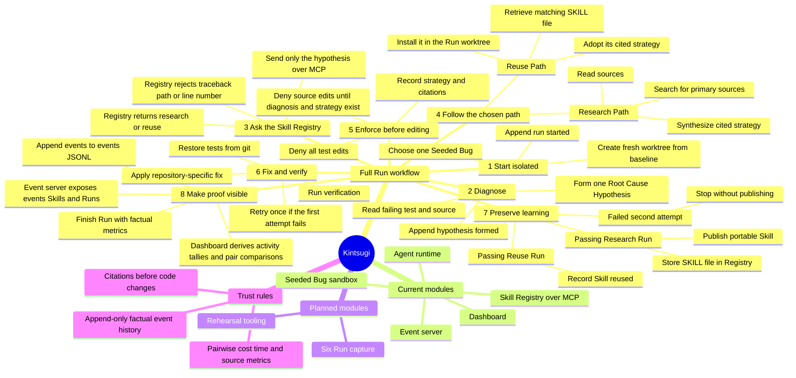
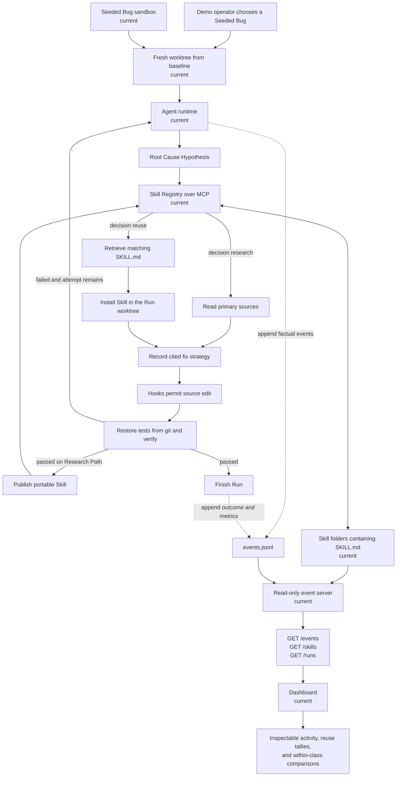
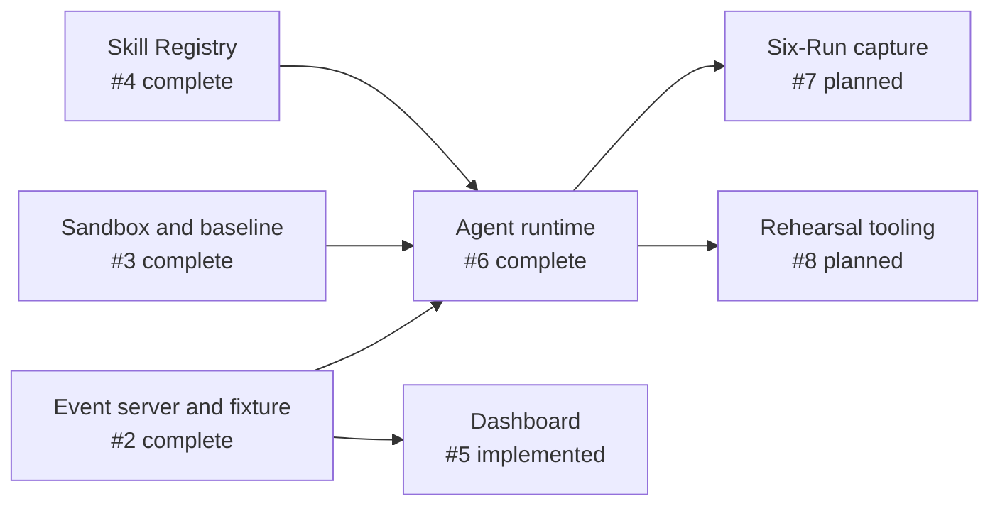

# Kintsugi architecture

Kintsugi is a bug-fixing agent that keeps what it learns. When it verifies a
fix, it turns the reusable reasoning into a portable Skill. A later agent facing
the same Root Cause Class can reuse that Skill instead of repeating the
research.

This page is the shared map for technical and non-technical teammates. The
module pages explain the implementation details.

## Status at a glance

- **Current:** the Seeded Bug sandbox, event fixture/server, dashboard, MCP
  Skill Registry, and agent runtime are implemented on `main`.
- **Planned:** the six-Run capture and rehearsal tooling are specified but not
  yet implemented.



## End-to-end data flow

Solid boxes marked **current** exist in this repository. Boxes marked
**planned** describe the accepted design for upcoming tickets.



The important trust split is deliberate:

1. The **agent records facts** such as tool use, sources, test results, tokens,
   and elapsed seconds.
2. The **event server reads and reshapes** those facts without deciding what
   they mean.
3. The **dashboard derives conclusions** such as reuse success tallies and
   Research Path versus Reuse Path comparisons.

The thing being measured therefore does not grade its own work.

## Module guide

| Area | Status | What it is for | Detailed page |
| --- | --- | --- | --- |
| Event server | Current | Makes the event log and Skills readable over HTTP without calculating conclusions | [Event server](event-server.md) |
| Dashboard | Current | Turns raw facts into a human-readable activity feed, Skill cards, and pair comparisons | [Dashboard](dashboard.md) |
| Skill Registry | Current | Lets any MCP-capable agent find, retrieve, publish, and list portable Skills | [Skill Registry](skill-registry.md) |
| Agent runtime | Current | Runs the diagnosis, research/reuse, edit, verification, and event-writing loop | [Agent runtime](agent-runtime.md) |
| Seeded Bug sandbox | Current | Supplies six controlled bugs and a clean baseline for fair, isolated Runs | [Sandbox](sandbox.md) |

## Shared contracts

### Domain language

Use the terms in [`CONTEXT.md`](../../CONTEXT.md), especially **Root Cause
Class**, **Root Cause Hypothesis**, **Skill**, **Skill Registry**, **Run**,
**Research Path**, and **Reuse Path**. Avoid cache language such as “hit” and
“miss”: the Registry returns the next action, `research` or `reuse`.

### Event log

Every event is one JSON object on one line and carries `ts`, `run_id`, `seq`,
and `type`. The accepted event types are:

```text
run_started
hypothesis_formed
registry_queried
source_read
strategy_recorded
patch_applied
tests_run
skill_published
skill_reused
run_finished
```

The log is append-only. It records facts, never derived speedup or confidence
claims.

### Skill storage

A Skill is a folder containing a Claude Code-compatible `SKILL.md`. The file is
the source of truth; there is no database mirror. A retrieved Skill is installed
under `.claude/skills/<skill-id>/SKILL.md` in the Run's isolated worktree so the
agent runtime can load it natively.

## Dependency order



The dashboard was intentionally built against the fixture. When the agent
starts writing real events, the same HTTP and event contracts should let the
dashboard consume them without changing its core projection logic.

## Source decisions

The architecture is constrained by the accepted decisions in
[`docs/adr/`](../adr/), particularly:

- [ADR-0001: Registry over MCP](../adr/0001-skill-registry-is-an-mcp-server-not-a-library.md)
- [ADR-0003: retrieval by Root Cause Hypothesis](../adr/0003-skills-are-retrieved-by-root-cause-hypothesis-not-error-text.md)
- [ADR-0005: no fix without a citation](../adr/0005-no-fix-without-a-citation.md)
- [ADR-0007: append-only factual event log](../adr/0007-the-agent-writes-an-append-only-event-log-and-computes-nothing.md)
- [ADR-0008: Agent SDK hooks enforce rules](../adr/0008-the-agent-is-the-claude-agent-sdk-with-hooks-as-enforcement.md)
- [ADR-0011: fresh worktree per Run](../adr/0011-each-run-gets-a-fresh-git-worktree.md)
- [ADR-0013: two attempts and publish only on green](../adr/0013-two-attempts-publish-only-on-green.md)
