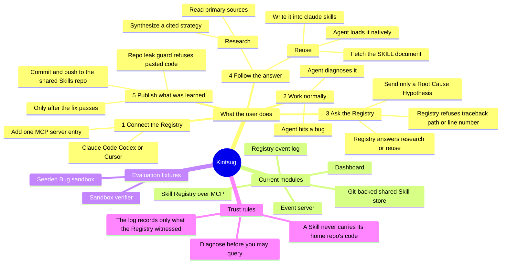
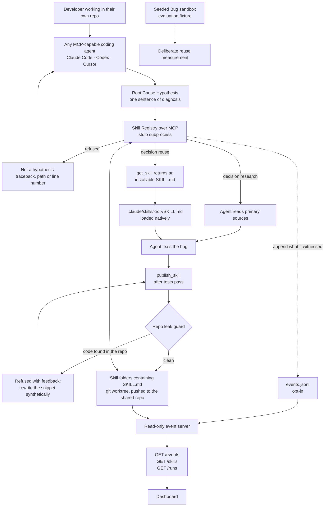

# Kintsugi architecture

Kintsugi is a Skill Registry that any coding agent can connect to over MCP. When
an agent verifies a bug fix, it publishes the reusable reasoning as a portable
Skill. A later agent — on a different machine, in a different repo, possibly a
different product entirely — facing the same Root Cause Class reuses that Skill
instead of repeating the research.

Kintsugi does not ship an agent. See
[ADR-0014](../adr/0014-kintsugi-is-an-mcp-server-not-an-agent.md).

This page is the shared map for technical and non-technical teammates. The
module pages explain the implementation details.

## Status at a glance

- **Current:** the MCP Skill Registry, its git-backed shared store, the two
  publish/query guards, the registry-level event log, the read-only event
  server, and the dashboard.
- **Kept as evaluation fixtures:** the Seeded Bug sandbox and its verifier. They
  are how reuse gets measured deliberately; they are not part of the tool.
- **Open:** `publish_skill` has no trust model now that hook enforcement is gone,
  and Skill ids collide on name with no versioning.



## End-to-end data flow



The trust split of [ADR-0007](../adr/0007-the-agent-writes-an-append-only-event-log-and-computes-nothing.md)
is intact, with a smaller author:

1. The **Registry records facts** — the decisions it made, the Skills that left
   it, the Skills published to it.
2. The **event server reads and reshapes** those facts without deciding what
   they mean.
3. The **dashboard derives conclusions** such as reuse tallies.

What changed is that the Registry can no longer witness token counts, wall-clock,
test results or patches. Those event types are **absent rather than estimated**.

## Module guide

| Area | Status | What it is for | Detailed page |
| --- | --- | --- | --- |
| Skill Registry | Current | Lets any MCP-capable agent find, retrieve, publish, and list portable Skills | [Skill Registry](skill-registry.md) |
| Event server | Current | Makes the event log and Skills readable over HTTP without calculating conclusions | [Event server](event-server.md) |
| Dashboard | Current | Turns raw facts into a readable activity feed and Skill cards | [Dashboard](dashboard.md) |
| Seeded Bug sandbox | Fixture | Six controlled bugs in matched pairs, for measuring reuse deliberately | [Sandbox](sandbox.md) |

## Shared contracts

### Domain language

Use the terms in [`CONTEXT.md`](../../CONTEXT.md), especially **Root Cause
Class**, **Root Cause Hypothesis**, **Skill**, **Skill Registry**, **Run**,
**Session**, **Research Path**, and **Reuse Path**. Avoid cache language such as
"hit" and "miss": the Registry returns the next action, `research` or `reuse`.

### Event log

Every event is one JSON object on one line and carries `ts`, `run_id`, `seq`,
and `type`. The Registry may only record what it observes first-hand:

```text
registry_queried
skill_retrieved
skill_published
```

`run_id` carries a **Session** id — one agent's connection to the Registry —
because the Registry cannot see where a Run begins or ends. The field keeps its
name so the event server and dashboard read the log unchanged.

`skill_retrieved` is deliberately not named `skill_reused`: the Registry watched
a document leave, which is a weaker claim than a Skill having produced a passing
fix. Logging is opt-in via `KINTSUGI_EVENTS_PATH`; unset, nothing is recorded.

The older, richer vocabulary (`run_started`, `hypothesis_formed`, `source_read`,
`strategy_recorded`, `patch_applied`, `tests_run`, `skill_reused`,
`run_finished`) is still what [`fixtures/events.jsonl`](../../fixtures/events.jsonl)
contains and what the dashboard renders, so a host that can produce those events
itself remains fully supported.

### Skill storage

A Skill is a folder containing a Claude Code-compatible `SKILL.md`. The file is
the source of truth; there is no database mirror. A retrieved Skill is installed
under `.claude/skills/<skill-id>/SKILL.md` so the connected agent loads it
natively — and because that is all a Skill is, the shared Skills repo can be
cloned straight into `.claude/skills/` with no server running at all.

## Source decisions

The architecture is constrained by the accepted decisions in
[`docs/adr/`](../adr/), particularly:

- [ADR-0001: Registry over MCP](../adr/0001-skill-registry-is-an-mcp-server-not-a-library.md)
- [ADR-0002: Skills are `SKILL.md`, guarded against repo leakage](../adr/0002-skills-are-claude-code-skill-documents.md)
- [ADR-0003: retrieval by Root Cause Hypothesis](../adr/0003-skills-are-retrieved-by-root-cause-hypothesis-not-error-text.md)
- [ADR-0005: no fix without a citation](../adr/0005-no-fix-without-a-citation.md)
- [ADR-0007: append-only factual event log](../adr/0007-the-agent-writes-an-append-only-event-log-and-computes-nothing.md)
- [ADR-0014: Kintsugi is an MCP server, not an agent](../adr/0014-kintsugi-is-an-mcp-server-not-an-agent.md)

ADRs 0008 through 0013 described the removed Agent SDK runtime and are retained
as superseded history.
