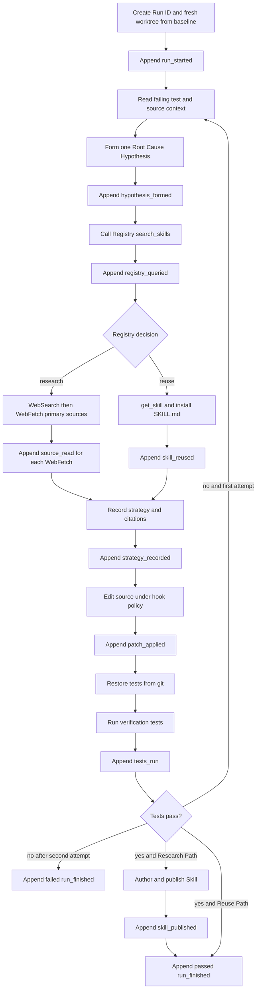

# Agent runtime

**Status: Current.** Implemented for issue
[#6](https://github.com/arnv15/Kintsugi/issues/6) under `agent/`, following
ADRs 0005, 0007–0011, and 0013.

The agent runtime will coordinate one complete Run: isolate a Seeded Bug,
diagnose its Root Cause Class, obtain a cited strategy through research or
reuse, apply and verify a fix, and publish learning only when the tests pass.

[Back to the architecture map](README.md)

## Use case

The runtime makes the project's rules enforceable rather than aspirational. A
model cannot edit tests, cannot edit source before recording a diagnosis and
cited strategy, cannot reuse a dirty worktree, and cannot publish a Skill for a
failed fix.

## Current dependencies

| Dependency | Status | Runtime use |
| --- | --- | --- |
| Event schema and append-only log from #2 | Current | Record every meaningful fact |
| `baseline` sandbox and Seeded Bugs from #3 | Current | Create an uncontaminated Run worktree |
| Skill Registry from #4 | Current | Search, retrieve, and publish Skills over MCP |
| `claude-agent-sdk==0.2.123` | Pinned in `agent/uv.lock` | Built-in code, shell, web, Skill, MCP, and hook capabilities |

The SDK's final `ResultMessage` supplies `usage`, `total_cost_usd`, and duration
facts. The runtime records the token fields and cost directly; it does not
derive comparisons.

## Current files

| Path | Responsibility |
| --- | --- |
| [`agent/src/kintsugi_agent/orchestrator.py`](../../agent/src/kintsugi_agent/orchestrator.py) | Creates one Run and closes its event stream |
| [`agent/src/kintsugi_agent/runner.py`](../../agent/src/kintsugi_agent/runner.py) | Builds the pinned SDK options, hooks, MCP connections, and prompt |
| [`agent/src/kintsugi_agent/hooks.py`](../../agent/src/kintsugi_agent/hooks.py) | Enforces edit, research/reuse, verification, and publish policy |
| [`agent/src/kintsugi_agent/runtime_tools.py`](../../agent/src/kintsugi_agent/runtime_tools.py) | Exposes hypothesis, strategy, Skill installation, and verification tools |
| [`agent/src/kintsugi_agent/verification.py`](../../agent/src/kintsugi_agent/verification.py) | Restores committed tests and enforces two attempts |
| [`agent/src/kintsugi_agent/worktrees.py`](../../agent/src/kintsugi_agent/worktrees.py) | Creates detached worktrees from `baseline` |
| [`agent/src/kintsugi_agent/events.py`](../../agent/src/kintsugi_agent/events.py) | Validates and appends the JSONL contract |

## One Run, end to end



There are at most two fix attempts. Research and reuse still share the same
edit and verification gates; reuse saves primary-source reading and strategy
synthesis, not diagnosis or testing.

## Agent SDK interface

The implementation uses the Claude Agent SDK because it supplies:

- `Read`, `Write`, `Edit`, `Bash`, `Glob`, and `Grep` for repository work;
- `WebSearch` and `WebFetch` for the Research Path;
- a native MCP client for the Skill Registry;
- native loading from `.claude/skills/*/SKILL.md`;
- `PreToolUse` and `PostToolUse` hooks for enforcement and observation.

`permission_mode` and `allowed_tools` must be configured deliberately so a Run
does not pause for interactive approval during the demo.

## Hook enforcement

### `PreToolUse`: test integrity

For every `Edit` or `Write`, normalize and resolve the target path against the
current Run worktree. Deny the call unconditionally when the resolved target is
under `tests/`.

The path check must not rely on a raw string prefix: `tests/../source.py`,
absolute paths, and symlinks must not bypass the intended worktree policy.

### `PreToolUse`: citation and ordering gate

For non-test `Edit` or `Write` calls, inspect the current Run's recorded state.
Permit editing only after both of these facts exist earlier in sequence:

1. `hypothesis_formed`;
2. `strategy_recorded` with citations.

The gate is the same on both paths. On the Research Path, sources come from
`WebFetch`; on the Reuse Path, they come from the installed Skill.

### Verification backstop

Immediately before the command that decides whether the fix passed, restore the
committed tests from git. This closes modification routes that do not cross
`Edit` or `Write`, such as a shell command.

The command should be scoped to the sandbox's test directory and run inside the
Run worktree. The authoritative acceptance wording uses:

```sh
git checkout -- tests/
```

If the sandbox remains a repository subdirectory, implementation must resolve
the equivalent correct path rather than accidentally restoring a nonexistent
root directory.

### `PostToolUse`: factual observation

Observe meaningful tool results and append the corresponding event. The hook
must preserve per-Run sequence order and never rewrite prior lines.

`WebSearch` discovers candidate pages; it does not count as a source read.
`WebFetch` reads a page, so each fetch produces `source_read`.

## Event ownership

The runtime is the sole writer of the Run event stream. Every line carries:

```text
ts, run_id, seq, type
```

The event-specific fields follow ADR-0007. Notably:

- `registry_queried` records the Registry's `decision`, `top_score`, and
  `skill_id` when present;
- `patch_applied` records files touched, not a claim about correctness;
- `tests_run` records pass/fail counts and output tail;
- `run_finished` records outcome, tokens, cost, seconds, and source count.

The runtime never writes speedup, confidence, or cross-Run comparisons.

## Worktree isolation

Each Run gets a new detached git worktree from the immutable `baseline` tag.
The runtime performs all reads, writes, Skill installation, and tests inside
that tree.

Benefits:

- earlier patches and untracked files cannot affect a later Run;
- the Run's final diff remains inspectable;
- Research/Reuse metrics are attributable to one Run;
- the paired demo can be repeated without resetting a shared checkout.

The runtime should retain a clear mapping from `run_id` to worktree path for
inspection and clean it up only through explicit rehearsal/demo lifecycle
tooling.

## Research Path details

1. Search the Registry only after diagnosis.
2. Use `WebSearch` to find primary documentation.
3. Use `WebFetch` to read selected sources.
4. Record source URLs and a synthesized strategy before editing.
5. Apply a repository-specific patch without copying that patch into the Skill.
6. Verify restored tests.
7. On green, author and publish one repo-agnostic Skill with citations and
   aliases.

## Reuse Path details

1. Receive `decision: "reuse"` from the Registry.
2. Fetch the winning Skill by ID.
3. Install it as `.claude/skills/<id>/SKILL.md` in the Run worktree.
4. Record its strategy and inherited citations.
5. Emit `skill_reused`.
6. Apply a repository-specific patch and verify restored tests.
7. Do not call `WebFetch` during the Run.

## Success, failure, and publishing

- Passing restored tests is the only definition of a verified fix.
- A Run stops after two failed attempts.
- Failed Runs remain in the event feed and are excluded from metric
  comparisons.
- Only a passing Research Path Run may call `publish_skill`.
- Emit `skill_published` only after the Registry confirms durable publication.
- A publish validation rejection returns feedback and may be retried; it does
  not turn a green fix into a failed fix.

## Test seam

Automated tests should invoke hook callbacks with constructed tool-call payloads
and event history, then assert on permission decisions and appended facts. A
full live agent Run costs network time and model tokens, so it belongs in dry-run
and demo verification rather than the fast unit suite.

The package also tests the exported Run boundary for fresh worktree commands,
test restoration, two-attempt stopping, SDK configuration, metrics, Skill
installation, event validation, and publish-only-after-green.

## Operator interface

`kintsugi-agent` takes one Run ID, Seeded Bug ID, Root Cause Class metadata, test
directory, and verification command. It retains the worktree under
`.kintsugi/runs/` and appends to `events.jsonl`; both paths can be overridden.
The complete command and Registry configuration are documented in
[`agent/README.md`](../../agent/README.md).
