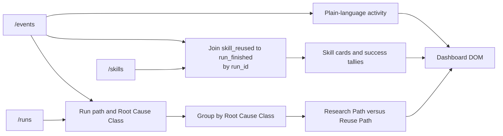

# Dashboard

**Status: Current.** Implemented for issue
[#5](https://github.com/arnv15/Kintsugi/issues/5) in commit `35fa466`.

The dashboard turns raw Run facts into an explanation a non-technical teammate
can follow. It is the only current module that derives visible conclusions such
as reuse tallies and within-class comparisons.

[Back to the architecture map](README.md)

## Use case

During a demo, a viewer should be able to answer:

- What did the agent do, in order?
- Which Skills exist and where did their strategies come from?
- Was a Skill reused, and did that reuse end in a passing Run?
- Within the same Root Cause Class, did reuse require fewer tokens, less time,
  and fewer sources than research?

## Current files

| File | Responsibility |
| --- | --- |
| [`public/index.html`](../../public/index.html) | Semantic dashboard structure and empty containers |
| [`public/dashboard.js`](../../public/dashboard.js) | Polling, projection, joins, comparison model, and DOM rendering |
| [`public/styles.css`](../../public/styles.css) | Responsive visual presentation |
| [`test/dashboard.test.js`](../../test/dashboard.test.js) | Model, join, grouping, fallback, and HTTP integration tests |

## Inputs

Every three seconds, `loadDashboardData` fetches these endpoints in parallel:

| Endpoint | Facts consumed |
| --- | --- |
| `/events` | Ordered activity, Run identity, Root Cause Class, Registry decision, Skill reuse, and outcomes |
| `/skills` | Skill name, aliases, strategy, and sources |
| `/runs` | Recorded tokens, cost, seconds, source count, and outcome |

If any request fails, the existing view remains in place and the live status
changes to “Event log unavailable.” The next scheduled poll tries again.

## Projection flow

`buildDashboardModel` is the main testable interface. It accepts
`{events, skills, runs}` and returns three view models:

- `activity`: every event, still in input order, with plain-language text;
- `skills`: Skill content plus `reused` and `succeeded` tallies;
- `comparisons`: Runs grouped by Root Cause Class with Research Path first.

## Reuse tally

The dashboard does not trust a precomputed success count.

1. Build a map from each `run_finished.run_id` to its `outcome`.
2. Find every `skill_reused` event for a Skill ID.
3. `reused` is the number of those events.
4. `succeeded` is the number whose Run outcome is `passed`.

This join makes “reused 2 times, 2 succeeded” traceable to raw facts.

## Pair comparison

For each Run, the dashboard joins:

- `run_started` for `bug_id` and `root_cause_class`;
- `registry_queried` for the Research Path or Reuse Path decision;
- `/runs` for tokens, cost, seconds, sources read, and outcome.

It groups only by Root Cause Class. It never presents the six heterogeneous
Seeded Bugs as one flat ranking. Within each group it shows:

1. tokens and cost;
2. wall-clock time;
3. sources read.

Cost is displayed when finite; tokens remain visible beside it. Bar widths are
relative only to the Runs in that Root Cause Class card.

## Current-to-planned integration note

The current fixture contains passing Runs, and the current comparison projector
includes any `/runs` entry that has enough matching event detail. ADR-0013 says
failed Runs must remain visible in the activity feed but be excluded from the
comparison chart. Issue #7 integration should add or verify that outcome filter
before the real six-Run capture is considered complete.

## Rendering behavior

- Summary counts show completed Runs, stored Skills, and the passing percentage.
- Activity text translates every accepted event type into plain language.
- Unknown event types still appear as “Recorded …” rather than disappearing.
- Empty states explain what data is waiting to arrive.
- Source links open independently and show a readable hostname.
- Polling reads files through the server; the dashboard has no direct
  filesystem access and no write capability.

## Module seam

The dashboard knows the three HTTP response contracts, not how the agent,
Registry, or files work internally. Its pure model builder gives tests the same
interface used by rendering, while browser-only DOM operations stay outside the
projection logic.
