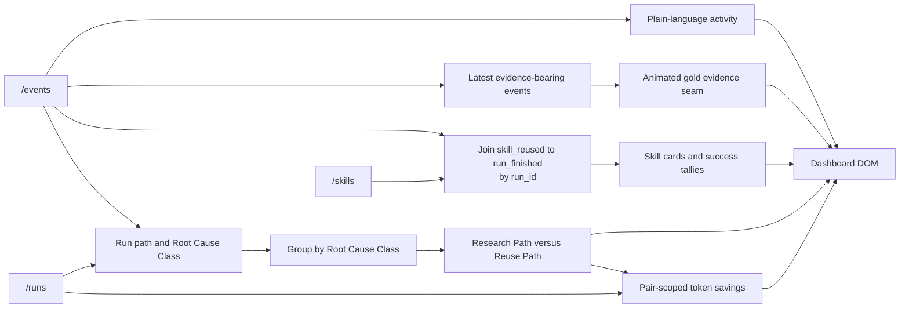

# Dashboard

**Status: Current.** Implemented for issue
[#5](https://github.com/arnv15/Kintsugi/issues/5) in commit `35fa466`.

The dashboard turns raw Run facts into an explanation a non-technical teammate
can follow. It is the only current module that derives visible conclusions such
as reuse tallies and within-class comparisons.

[Back to the architecture map](README.md)

## Use case

During a demo, a viewer should be able to answer:

- What did the agent do, in order?
- Which Skills exist and where did their strategies come from?
- Was a Skill reused, and did that reuse end in a passing Run?
- Within the same Root Cause Class, did reuse require fewer tokens, less time,
  and fewer sources than research?

## Current files

| File | Responsibility |
| --- | --- |
| [`public/index.html`](../../public/index.html) | Semantic page structure: explainer, install, and dashboard containers |
| [`public/dashboard.js`](../../public/dashboard.js) | Polling, projection, joins, comparison model, DOM rendering, scroll-reveal, and copy-to-clipboard |
| [`public/styles.css`](../../public/styles.css) | Responsive visual presentation |
| [`test/dashboard.test.js`](../../test/dashboard.test.js) | Model, join, grouping, fallback, and HTTP integration tests |

## Page structure

The page is one scroll, with `<nav>` anchors jumping to the authored repair
story and live evidence:

1. **Hero** — a cinematic repaired-bowl composition with animated gold seams
   and live counts for completed Runs, verified outcomes, stored Skills, and
   tokens avoided in complete within-class comparison pairs.
2. **The repair** (`#repair`) — a four-step authored explanation of diagnose,
   query, verify, and preserve. Its vertical animated seam is decorative; the
   wording must stay in sync with
   [`docs/architecture/skill-registry.md`](skill-registry.md).
3. **The living seam** (`#evidence`) — an SVG projection of the latest ten
   evidence-bearing events. Node titles expose the underlying plain-language
   event descriptions, and the seam distinguishes a latest verified finish
   from evidence still accumulating.
4. **Research against reuse** — the existing within-Root-Cause-Class Run
   comparisons, presented as paired metric bars.
5. **Portable repairs** (`#skills`) — Skill strategy, symptom, sources, and
   reuse outcomes. The circular indicator is an observed verified-reuse ratio;
   a never-reused Skill is labeled “New” instead of displaying a made-up
   confidence score.
6. **Append-only history** — every event in recorded order, translated to
   plain language.

The bowl image is decorative and the live seam is an accessible SVG image.
Keyboard focus has a visible gold outline, the page begins with a skip link,
and `prefers-reduced-motion` reduces every seam, node, pulse, and bar animation
to its final state.

## Inputs

Every three seconds, `loadDashboardData` fetches these endpoints in parallel:

| Endpoint | Facts consumed |
| --- | --- |
| `/events` | Ordered activity, Run identity, Root Cause Class, Registry decision, Skill reuse, and outcomes |
| `/skills` | Skill name, aliases, strategy, and sources |
| `/runs` | Recorded tokens, cost, seconds, source count, and outcome |

If any request fails, the existing view remains in place and the live status
changes to “Event log unavailable.” The next scheduled poll tries again.

## Projection flow

`buildDashboardModel` is the main testable interface. It accepts
`{events, skills, runs}` and returns four view models:

- `activity`: every event, still in input order, with plain-language text and
  whether a finish represents a verified Run;
- `skills`: Skill content plus `reused` and `succeeded` tallies;
- `comparisons`: Runs grouped by Root Cause Class with Research Path first.
- `summary`: completed and passing counts, passing percentage, token and
  duration totals, reuse count, and pair-scoped avoided tokens.

## Reuse tally

The dashboard does not trust a precomputed success count.

1. Build a map from each `run_finished.run_id` to its `outcome`.
2. Find every `skill_reused` event for a Skill ID.
3. `reused` is the number of those events.
4. `succeeded` is the number whose Run outcome is `passed`.

This join makes “reused 2 times, 2 succeeded” traceable to raw facts.

## Pair comparison

For each Run, the dashboard joins:

- `run_started` for `bug_id` and `root_cause_class`;
- `registry_queried` for the Research Path or Reuse Path decision;
- `/runs` for tokens, cost, seconds, sources read, and outcome.

Failed Runs remain visible in activity and summary counts but are excluded
from comparisons, including when an SDK failure leaves token or cost facts
unavailable. Passing Runs are grouped only by Root Cause Class. The dashboard
never presents the six heterogeneous Seeded Bugs as one flat ranking. Within
each group it shows:

1. tokens and cost;
2. wall-clock time;
3. sources read.

Cost is displayed when finite; tokens remain visible beside it. Bar widths are
relative only to the Runs in that Root Cause Class card.

The hero's avoided-token count is also derived only from complete comparable
pairs. For each pair, it adds `max(0, research tokens - reuse tokens)`. An
unpaired Research Path never inflates the number.

## Rendering behavior

- Summary counts show completed Runs, stored Skills, passing percentage, and
  pair-scoped avoided tokens.
- The living seam uses the latest ten `run_started`, `hypothesis_formed`,
  `registry_queried`, `patch_applied`, `tests_run`, and `run_finished` events.
- Activity text translates every accepted event type into plain language.
- Unknown event types still appear as “Recorded …” rather than disappearing.
- Empty states explain what data is waiting to arrive.
- Source links open independently and show a readable hostname.
- A successful poll is fingerprinted; unchanged data updates status and time
  without rebuilding the DOM or restarting seam animations.
- A failed first poll replaces loading copy with explicit retrying states. A
  later failed poll keeps the last successful evidence visible.
- Polling reads files through the server; the dashboard has no direct
  filesystem access and no write capability.

## Module seam

The dashboard knows the three HTTP response contracts, not how the agent,
Registry, or files work internally. Its pure model builder gives tests the same
interface used by rendering, while browser-only DOM operations stay outside the
projection logic.
