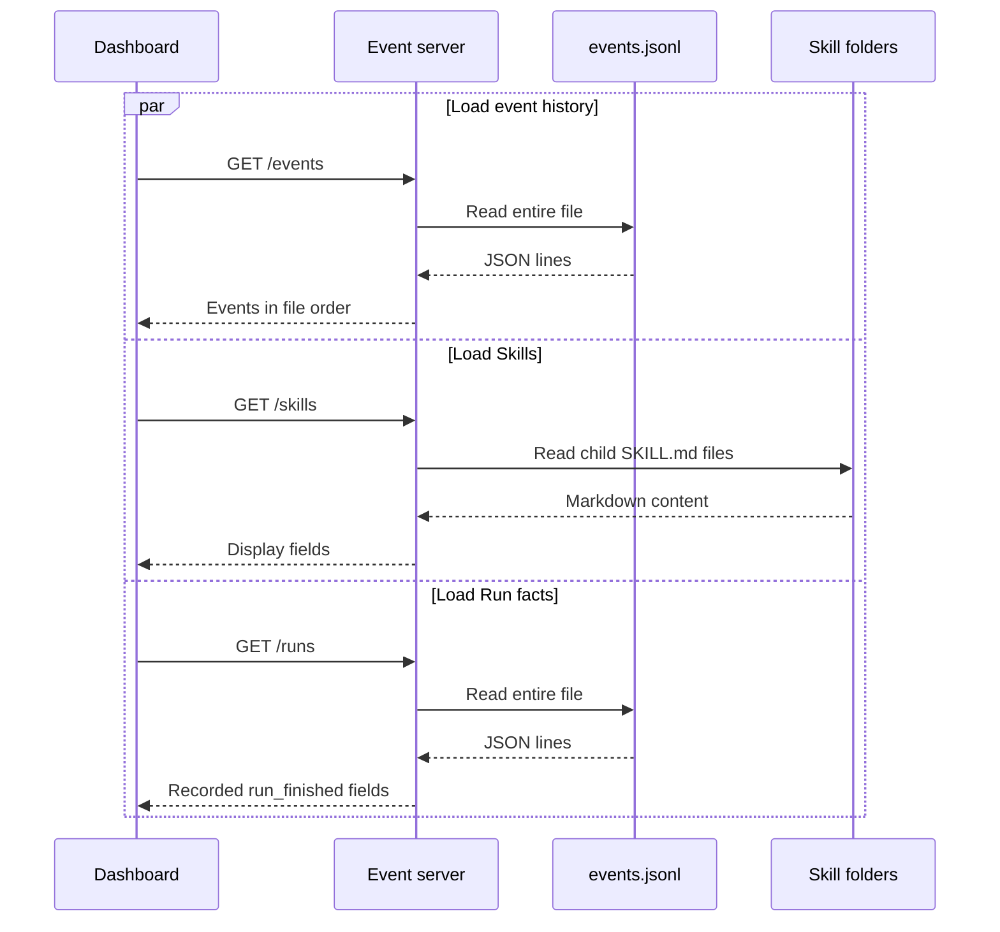

# Event server

**Status: Current.** Implemented for issue
[#2](https://github.com/arnv15/Kintsugi/issues/2) in commit `b035b11`.

The event server is a read-only adapter between files on disk and the
dashboard. It makes the event history and Skills easy to consume over HTTP while
keeping all interpretation out of the server.

[Back to the architecture map](README.md)

## Use case

A teammate can start one process, open the dashboard, and inspect a Run even if
the agent is not running. During early development, the server reads the bundled
fixture. Later, it can read the real agent event log and Registry Skill
directory through configuration alone.

## Current files

| File | Responsibility |
| --- | --- |
| [`src/index.js`](../../src/index.js) | Resolves configuration and starts the HTTP server |
| [`src/server.js`](../../src/server.js) | Reads files, projects response fields, and serves HTTP routes |
| [`fixtures/events.jsonl`](../../fixtures/events.jsonl) | Complete example Research Path and Reuse Path Runs |
| [`fixtures/skills/`](../../fixtures/skills/) | Two example Skill folders |
| [`test/server.test.js`](../../test/server.test.js) | Verifies route behavior and fixture ordering |

## HTTP interface

| Request | Current response | Explicitly does not do |
| --- | --- | --- |
| `GET /events` | Every parsed JSONL event in file order | Reorder, group, summarize, or infer |
| `GET /skills` | Each Skill's `id`, `name`, `description`, `aliases`, `sources`, and display `strategy` | Match hypotheses or decide reuse |
| `GET /runs` | One projection per `run_finished` event with recorded metrics and outcome | Count sources, calculate cost, compare Runs, or calculate speedup |
| `GET /` | Dashboard HTML | Server-side rendering |
| `GET /dashboard.js` and `GET /styles.css` | Local dashboard assets with no-cache headers | Bundle or transform assets |
| `GET /kintsugi-bowl.png` | Decorative repaired-bowl artwork used by the dashboard hero | Transform or derive the image |
| Any unknown route | `404 {"error":"Not found"}` | Route fallback |

The `/runs` response is a field projection, not an aggregation. For example,
the server returns the `sources_count` recorded on `run_finished`; it does not
count `source_read` events.

## Startup and configuration

Run:

```sh
npm start
```

The default address is `http://127.0.0.1:3000`.

| Environment variable | Default | Meaning |
| --- | --- | --- |
| `EVENTS_PATH` | `fixtures/events.jsonl` | JSONL event log to read |
| `SKILLS_PATH` | `fixtures/skills` | Directory whose child folders contain `SKILL.md` |
| `HOST` | `127.0.0.1` | Listening host |
| `PORT` | `3000` | Listening port |

## Request flow



Files are read on every request. This keeps the interface stateless and means
newly appended events appear on the next dashboard poll without restarting the
server.

Static routes are matched against the parsed request pathname, so query
parameters do not change the route contract.

## Parsing behavior

- Empty lines in `events.jsonl` are ignored.
- Every non-empty line must be valid JSON.
- Skill IDs come from sorted child-directory names.
- Skill display fields are read from YAML-like frontmatter.
- The displayed strategy is the final prose paragraph after frontmatter and
  code blocks; it falls back to `description`.

This parsing is intentionally small and tailored to the current fixture
contract. The future Registry owns full publish-time validation; the event
server assumes stored Skills are already valid.

## Interface seam

Callers need to know only the three JSON endpoints and their recorded fields.
They do not need access to agent internals, Registry matching, or filesystem
layout beyond server configuration. That seam lets fixture data be replaced by
real Run data without changing dashboard logic.

## Runtime integration

With issues #4 and #6 implemented:

1. `EVENTS_PATH` points at the agent's real append-only log.
2. `SKILLS_PATH` points at the Registry's authoritative Skill directory.
3. The server continues to read on demand.
4. The dashboard continues to derive all tallies and comparisons.

No write endpoint is planned. The agent writes events and the Skill Registry
writes Skills; this server remains a read-only view.
