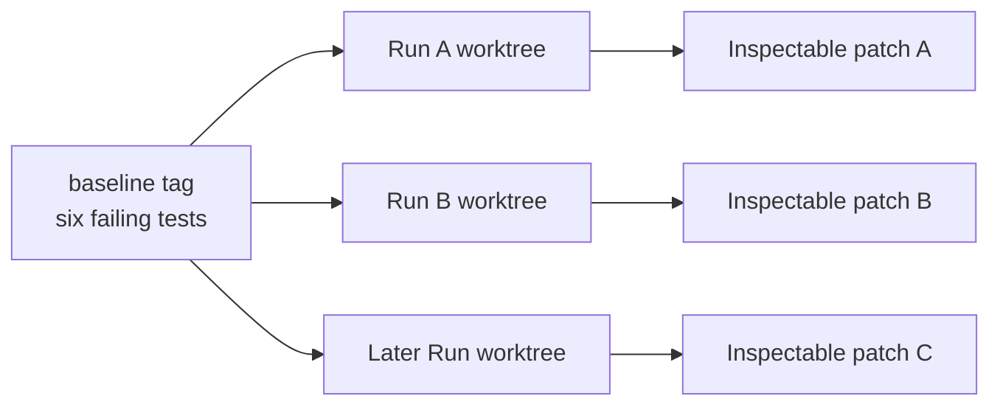

# Seeded Bug sandbox

**Status: Current.** Implemented and verified for issue
[#3](https://github.com/arnv15/Kintsugi/issues/3). The immutable `baseline` tag
points to seeded commit `e92d641`; verification is recorded at `13aa81f`.

The sandbox supplies six controlled failures that let Kintsugi demonstrate
learning without letting one Run contaminate another.

[Back to the architecture map](README.md)

## Use case

Each Root Cause Class appears twice in deliberately different code. The first
instance should take the Research Path and publish a Skill. The second should
look different on the surface but produce a matching Root Cause Hypothesis and
take the Reuse Path.

That pair structure tests whether the Skill carries reusable reasoning rather
than a copied patch.

## Current layout

| Root Cause Class | First Seeded Bug | Paired Seeded Bug |
| --- | --- | --- |
| DST-boundary datetime arithmetic | `scheduling.py::next_run_at` preserves elapsed time when the requirement is the same local appointment | `reports.py::shift_duration` uses wall-clock subtraction when the requirement is real elapsed time |
| Money represented as float instead of Decimal | `checkout.py::total_with_tax` enters float arithmetic before cent rounding | `payouts.py::split_evenly` uses float rounding and loses the remainder cent |
| `asyncio` exception semantics | `fetcher.py::fetch_all` turns dependency failures into apparently complete results | `writer.py::flush` reports completion without awaiting writes |

The paired functions differ in file, function name, data types, public
interface, test wording, and assertion shape. Within each pair, the intended
fixes remain comparable in size.

## Files

| Path | Responsibility |
| --- | --- |
| [`sandbox/`](../../sandbox/) | Six deliberately incorrect Python functions |
| [`sandbox/tests/`](../../sandbox/tests/) | One failing behavioral test per Seeded Bug |
| [`sandbox/README.md`](../../sandbox/README.md) | Safe Run instructions visible at baseline |
| [`scripts/sandbox_root_cause_classes.md`](../../scripts/sandbox_root_cause_classes.md) | Authoring-only diagnoses and shared strategies |
| [`scripts/verify_sandbox.py`](../../scripts/verify_sandbox.py) | Acceptance verifier for tag, failures, distinctness, fixes, and comparability |

The authoring note and verifier are intentionally absent from the `baseline`
tag. A Run must diagnose the bug rather than reading the answer from repository
documentation.

## Baseline contract

`baseline` is the immutable starting commit for every Run.



Create a disposable worktree and run one target test:

```sh
git worktree add --detach /tmp/kintsugi-run baseline
cd /tmp/kintsugi-run
python3 -m unittest sandbox.tests.test_scheduling -v
```

All six tests are red together at baseline. A Run selects one Seeded Bug and is
judged by its corresponding test; the other five failures are expected until
their own isolated Runs.

## Verification performed by the repository

`python3 scripts/verify_sandbox.py` checks:

1. `baseline` resolves to a commit containing all six source and six test files.
2. The baseline suite discovers six tests and all six fail.
3. Each pair uses different files, functions, signatures, test wording, and
   assertion shapes.
4. Applying each intended fix in its own temporary baseline worktree makes its
   one target test pass.
5. The two fixes in each Root Cause Class are comparable in changed-line count.

The verifier creates and removes temporary git worktrees. It does not repair the
main checkout.

## Runtime relationship

Issue #6 will:

1. create a new worktree from `baseline` for each Run;
2. install any retrieved Skill only inside that worktree;
3. deny edits to its tests;
4. restore tests from git before verification;
5. retain the Run's source diff for inspection.

The sandbox contains the measurement subjects. It does not call the agent,
Registry, event server, or dashboard itself.

## Adding or changing a Seeded Bug

A change is architecture-relevant when it changes a Root Cause Class, pair
relationship, baseline layout, test interface, or Run dependency. Update this
page and the shared map with the ticket.

Preserve these invariants:

- the pitfall has trustworthy primary documentation;
- the model should not reliably solve it from memory without research;
- the two instances look different while sharing one conceptual fix strategy;
- the tests fail for the intended seeded reason;
- the fixes are comparable enough for within-class metrics;
- no diagnosis or solution artifact is reachable from `baseline`.
