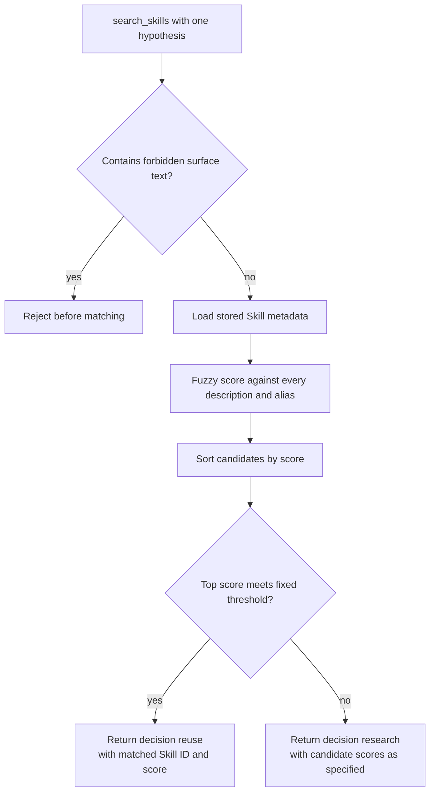
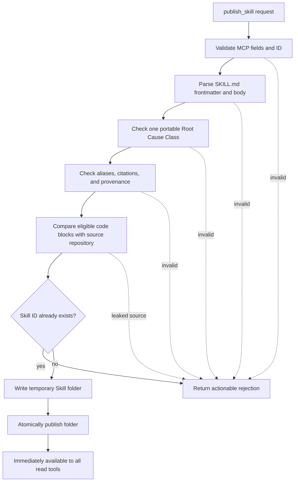

# Skill Registry

**Status: Planned.** Specified by issue
[#4](https://github.com/arnv15/Kintsugi/issues/4) and ADRs 0001–0003; no Registry
implementation exists on `main` yet.

The Skill Registry is the shared store of portable Skills. It is a standalone
MCP server so any MCP-capable agent can reuse Kintsugi's learning without
importing this repository as a library.

[Back to the architecture map](README.md)

## Use case

An agent diagnoses a bug in its own words, sends that Root Cause Hypothesis to
the Registry, and receives an independently computed next step:

- `reuse` when a stored Skill describes the same Root Cause Class; or
- `research` when no stored Skill clears the fixed match threshold.

The Registry, rather than the agent, owns this decision so the event log records
an externally produced fact instead of the agent's self-assessment.

## Planned MCP tool interface

The exact transport schema will be implemented and tested in issue #4. The
accepted logical inputs and outputs are:

| Tool | Input | Output | Purpose |
| --- | --- | --- | --- |
| `search_skills` | `{ hypothesis: string }` | `{ decision: "reuse" | "research", matches: [{ id, name, description, score }] }` | Validate one Root Cause Hypothesis, score all Skills, and choose the path |
| `get_skill` | `{ id: string }` | `{ id, content }` or a not-found error | Return the complete authoritative `SKILL.md` for installation |
| `publish_skill` | `{ id, content, source_repo_path, publisher }` | `{ id, published: true }` or actionable validation errors | Validate and atomically add one Skill folder |
| `list_skills` | `{}` | `[{ id, name, description, aliases, sources }]` | Inspect available Skills without making a reuse decision |

`content` is the complete `SKILL.md`, including YAML frontmatter and prose body.
Keeping Markdown as the publish payload avoids inventing a second document
format that could drift from the file agents actually install.

`source_repo_path` identifies the repository the Skill was learned from. It is
used only during publish validation to prevent source-code leakage. `publisher`
records provenance for a store shared by multiple agents. The implementation
ticket should pin their concrete JSON schema and error codes at the MCP seam.

## Search and decision lifecycle



Matching is fuzzy token-set comparison, as recorded in ADR-0003. Each Skill's
`description` and 3–5 `aliases` provide different phrasings of the same Root
Cause Class. The Registry scores server-side, applies one fixed threshold, and
returns ordered matches. The caller does not download the list and choose its
own verdict.

### Why search rejects tracebacks, paths, and line numbers

The only valid query is one sentence of diagnosis. A traceback, repository
path, or line number describes where and how one bug surfaced, not the Root
Cause Class that can recur elsewhere.

Rejecting those shapes before matching forces the agent to diagnose first. It
also prevents a superficially similar second bug from being selected merely
because its error text resembles the first. This guard is part of the Registry
interface, not a prompt suggestion.

Examples:

| Input | Result |
| --- | --- |
| “aware datetime arithmetic mixes elapsed and wall-clock semantics across an offset transition” | Valid Root Cause Hypothesis |
| `Traceback (most recent call last)` | Rejected |
| `sandbox/reports.py:42` | Rejected |
| `C:\repo\reports.py line 42` | Rejected |

## Research versus reuse

### Reuse Path

1. `search_skills` returns `decision: "reuse"` plus the winning Skill ID and
   score.
2. The agent calls `get_skill(id)`.
3. It writes the returned content to
   `.claude/skills/<id>/SKILL.md` inside the Run's worktree.
4. The Agent SDK loads the Skill natively.
5. The agent records the Skill's cited strategy, emits `skill_reused`, and
   proceeds without `WebFetch`.

### Research Path

1. `search_skills` returns `decision: "research"`.
2. The agent uses `WebSearch` to discover primary sources and `WebFetch` to read
   them.
3. It records a cited fix strategy, applies a fix, and verifies the restored
   tests.
4. Only after a passing verification does it author a portable Skill and call
   `publish_skill`.
5. A successful publish makes the Skill immediately visible to
   `list_skills`, `get_skill`, and the next `search_skills` call.

The Registry decides the branch. The agent executes the branch and enforces
“publish only on green.”

## Publish validation lifecycle

Publishing should be a retryable validation pipeline:



At minimum, issue #4 must validate:

1. Required MCP fields are present and the ID is safe as one directory name.
2. The payload is a parseable `SKILL.md`.
3. Frontmatter contains `name`, `description`, 3–5 `aliases`, and cited
   `sources`; provenance is retained.
4. The document describes one Root Cause Class and does not carry a literal
   repository patch.
5. Every code block longer than two lines is whitespace-normalized and checked
   against the supplied source repository. A substring match is rejected.
6. A rejection explains what must be rewritten, so the agent can retry with a
   synthetic illustration rather than abandoning the Run.
7. The final directory write is atomic enough that readers never observe a
   half-written Skill.

The source-leak guard is mechanical. General prose portability checks that
cannot be made reliably mechanical should remain explicit validation policy and
test cases rather than being presented as stronger guarantees than they are.

## Filesystem storage and agent relationship

Planned authoritative layout:

```text
<registry-root>/
  <skill-id>/
    SKILL.md
```

There is no database. `list_skills` and `search_skills` read metadata from these
files; `get_skill` returns one file; `publish_skill` creates one folder.

For a Reuse Path Run, the agent installs the retrieved document at:

```text
<run-worktree>/.claude/skills/<skill-id>/SKILL.md
```

The Registry copy is authoritative shared storage. The worktree copy is an
isolated installation for one Run and disappears with that worktree. Both use
the identical Claude Code Skill format, so no translation layer or second
record of truth is required.

The event server's `SKILLS_PATH` can point at `<registry-root>` to expose the
same stored documents to the dashboard.

## Reset and rehearsal isolation

Issue #8 requires a cold-to-warm sequence to be repeatable. The Registry
therefore needs a maintenance capability to clear a rehearsal store or select a
fresh scoped root.

That capability should not silently become a fifth agent-facing MCP tool:
ordinary agents need read and publish access, not permission to erase shared
learning. The planned rehearsal command can instead stop the server, clear a
known rehearsal-only directory, or start it with a new scoped
`<registry-root>`. Issue #8 owns the final command and safety checks; issue #4
must provide the underlying resettable/scoped storage seam.

## Errors callers must handle

- Invalid Root Cause Hypothesis shape: revise the diagnosis, then search again.
- No match: take the Research Path; this is a valid decision, not an error.
- Unknown Skill ID: do not proceed as reuse; search again or fail the Run
  visibly.
- Invalid or source-leaking publish: rewrite from the returned feedback and
  retry.
- Storage failure: leave the Run result visible, but do not emit
  `skill_published` until persistence succeeds.
